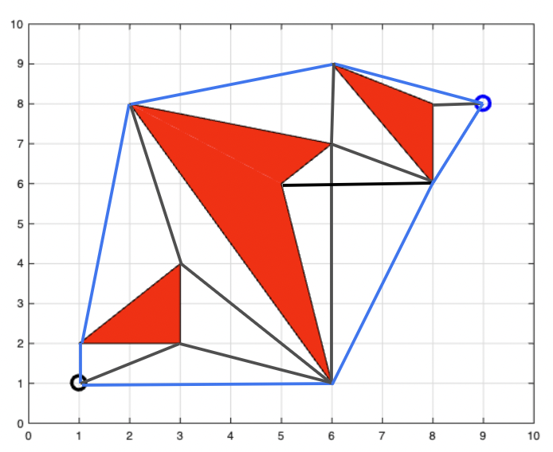
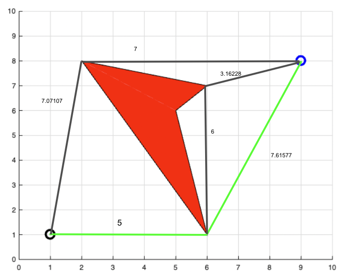
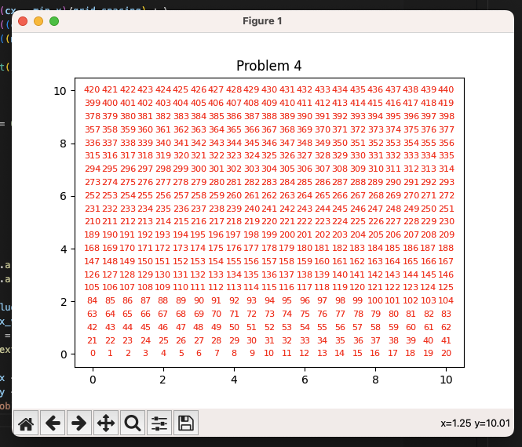

# HW1
#### Github Link: https://github.com/venkatmanavarthi/HW1
## Problem 1
Using the map shown below, generate the visibility graph (include the start and end nodes).
Additionally, show the reduced visibility graph with a different color (i.e. blue for reduced graph,
black for remaining standard edges). You do not need to compute the edge costs.



## Problem 2
Using the Python Class tutorial available at https://docs.python.org/3/tutorial/classes.html, create a
class called node that has the following instance variables, x, y, parent_cost, and index. Provide
your short Python script that contains this class.

```
class node:
    def __init__(self, x, y, parent_cost, index):
        self.x = x
        self.y = y
        self.parent_cost = parent_cost
        self.index = index
```
```
# root node
root_node = node(0, 0, 0, 0)
```

## Problem 3
Using the map shown below, show the reduced visibility graph along with the Euclidean distance for
each edge. Highlight the shortest path from the start (1,1) to the goal (9,8).

```
d = √(x2 - x1)^2 + (y2 - y1)^2
```
1. Distance from (1,1) to (6, 1) - 5
2. Distance from (1,1) to (2, 8) - 7.07107
3. Distance from (6, 1) to (9, 8) - 7.61577
4. Distance from (2, 8) to (9, 8) - 7
5. Distance from (6, 1) to (6, 7) - 6
6. Distance from (6, 7) to (9, 8) - 3.16228

#### The Shortest Distance is from (1, 1) -> (6,1) -> (9, 8) = 12.61577


## Problem 4
Given the following map parameters, generate a figure similar to the one shown in which you are
computing each node index and plotting the index at the corresponding node location. The node
index is simply the unique name/value associated with the node. You need to write your Python
script such that any node location (x and y pair) returns the node index. I.e. simply making counter
that plots at each node location will not work. This node index is crucial in generating grid-based
path planning techniques. A small function that computes the node index is an efficient method for
computing the index.

Grid Spacing = 0.5
Min X = 0 Max X = 10 (include both 0 and 10 in your grid)
Min Y = 0 Max Y = 10

Notes:
When generating the x and y values (that span from 0 to 10), the NumPy command arange is
particularly useful. Make sure that you capture the end point by adding an extra “grid_size” onto the
end value.

Matplotlib.text(x, y, str(int(number to display)), color=”red”, fontsize=8) is a good function to use to
stick the text in the figure.

```
import matplotlib.pyplot as plt
import numpy as np

# function to compute index for each x and y
def compute_index(min_x, max_x, min_y, max_y, grid_spacing, cx, cy) -> int:

    index = ((cx - min_x)/grid_spacing) + \
            (((cy - min_y)/grid_spacing) * \
            (((max_x + grid_spacing)-min_x)/grid_spacing))

    return int(index)
    

# step
grid_spacing = 0.5

# X
min_x = 0
max_x = 10

# Y
min_y = 0
max_y = 10

x_values = np.arange(min_x, max_x + grid_spacing, grid_spacing)
y_values = np.arange(min_y, max_y + grid_spacing, grid_spacing)

for y in y_values:
    for x in x_values:
        index = compute_index(min_x, max_x, min_y, max_y, grid_spacing, x, y)
        plt.text(x, y, str(index), color='red', fontsize=8, ha='center', va='center')

plt.xlim(min_x - grid_spacing, max_x + grid_spacing)
plt.ylim(min_y - grid_spacing, max_y + grid_spacing)
plt.title("Problem 4")
plt.show()
```

