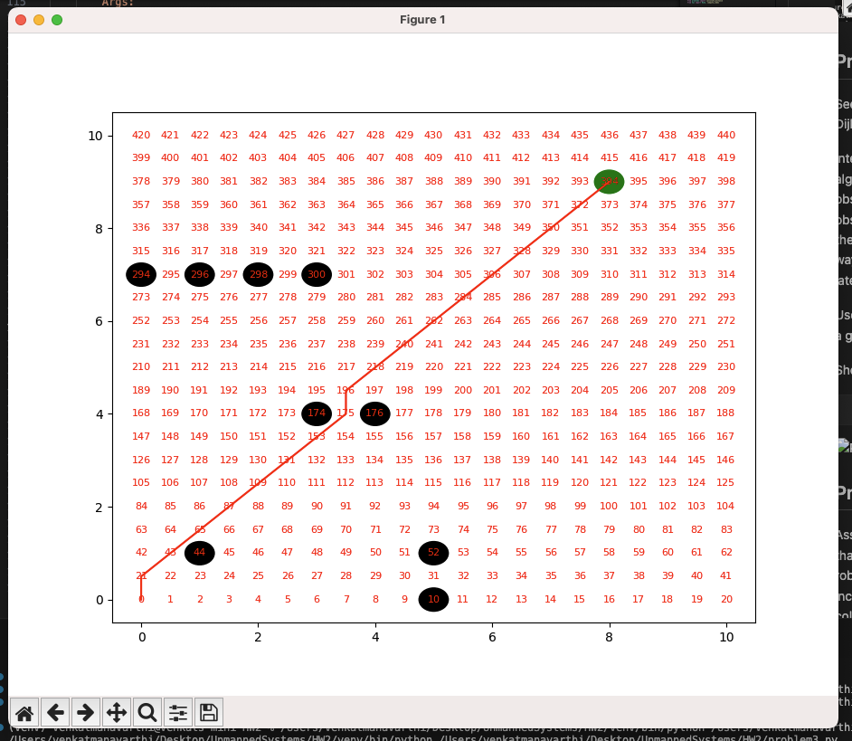

# Unmanned Systems HW2

## Problem 1
Problem 1:
Create a function that calculates the distance from one node to another.
Pass two nodes to the function and return the Euclidean distance. Test your
function by having it calculate the distance from (2,1) to (3,2). Make sure
the answer is correct.
```
d = √(x2 - x1)^2 + (y2 - y1)^2
```

```
import math


def calculate_distance(x1, y1, x2, y2):
    """
    Args:
      x1: X for input location 1 
      x2: Y for input location 1
      y1: X for input location 2
      y2: Y for input location 2

    Returns:
      The Euclidean distance
    """
    return round(math.sqrt((x2 - x1)**2 + (y2 - y1)**2), 2)


if __name__ == "__main__":
    print(calculate_distance(x1=2, y1=1, x2=3, y2=2))
```

## Problem 2
Problem 2:
Create a function that checks if the current node is valid based upon the list
of obstacles, grid boundaries, and current location.

Using an obstacle list of (1,1), (4,4), (3,4), (5,0), (5,1), (0,7), (1,7), (2,7), and
(3,7); and a bounding box of 0 to 10 for both x and y, and step size of 0.5,
verify that the location (2,2) is valid. Assume the obstacles have a diameter
of 0.5 (only occupy the node at which they reside).

Pass the obstacle list, node, and map boundaries/step size, and return a
Boolean True/False depending on if the node location is valid (reachable).

```
from problem1 import calculate_distance
import matplotlib.pyplot as plt

class Obstacle:
    def __init__(self, x, y, radius=0) -> None:
        self.x = x
        self.y = y
        self.radius = radius

    def is_inside(self, cur_x, cur_y, r_radius=0) -> bool:
        """
        Args:
          ob_x: X position of the obstacle
          ob_y: Y position of the obstacle
          cur_x: X position of the robot
          cur_y: Y potition of the robot
          r_radius: Robot radius

        Returns:
          True if point is inside the obstacle
          False if point is outside the obstacle
        """
        dis = calculate_distance(cur_x, cur_y, self.x, self.y)
        if dis > (self.radius + r_radius):
            return False
        return True


def is_valid(obs, x_min, y_min, x_max, y_max, cur_x, cur_y, r_radius=0) -> bool:
    for each_obs in obs:
        if each_obs.is_inside(cur_x, cur_y, r_radius):
            return False
        
    if x_min > cur_x:
        return False
    if x_max < cur_x:
        return False
    if y_min > cur_y:
        return False
    if y_max < cur_y:
        return False
    
    return True


if __name__ == "__main__":
    obs_pos = [(1, 1), (4, 4), (3, 4), (5, 0), (5, 1),
               (0, 7), (1, 7), (2, 7), (3, 7)]
    obs_radius = 0.25
    r_radius = 0.25
    
    cur_x, cur_y = 2, 2
    
    obs_list = [Obstacle(each_ob[0], each_ob[1], obs_radius)
                for each_ob in obs_pos]
    x_min, y_min, x_max, y_max = 0, 0, 10, 10
    if is_valid(obs_list, x_min, y_min, x_max, y_max, cur_x, cur_y, r_radius):
        print("Valid Location")
    else:
        print("Invalid Location")
    
    fig, ax = plt.subplots()
    ax.set_xlim(0, 10)
    ax.set_ylim(0, 10)    
    for obs in obs_list:
        obs_plot = plt.Circle((obs.x, obs.y), obs.radius, color='blue')
        ax.add_patch(obs_plot)
    
    agent_plot = plt.Circle((cur_x, cur_y), r_radius, color='red')
    ax.add_patch(agent_plot)
    plt.show()  
```


## Problem 3
See pseudocode on Canvas for significant assistance in the
implementation of Dijkstra’s Algorithm.

Integrate your functions into a script with a function that runs Dijkstra’s
algorithm given the starting location, goal location, grid information, and
obstacle list. The function should end with a plot showing the grid space
with obstacles (can just use markers for the obstacles) and the desired path
from the start location to the goal location. Your function should return this
list of waypoints for the desired path. The waypoint list will be used for the
Turtlebots later in the semester.

Use the grid information above (Problem 2) with a starting location of (0,0)
and a goal location of (8, 9).

Show the plot of the grid and desired path.

```
from problem2 import Obstacle, is_valid
from problem1 import calculate_distance
from hw1 import Node, compute_index


class Dijkstras:
    """
    Args:
      min_x: Grid Bounds
      min_y: Grid Bounds
      max_x: Grid Bounds
      max_y: Grid Bounds
      gs: Grid Space/Step
    Returns:
      None
    """

    def __init__(self, min_x, min_y, max_x, max_y, gs) -> None:
        self.start = None
        self.goal = None
        self.obs_list = None
        self.visited = {}
        self.unvisited = {}
        self.min_x = min_x
        self.max_x = max_x
        self.min_y = min_y
        self.max_y = max_y
        self.gs = gs

    def run(self, start: tuple, goal: tuple, obs_list: list = [], r_radius=0, inflate=False) -> list:
        """
        Args:
          start(tuple): x,y representing the start location of the robot
          goal(tuple): x,y representing the goal location of the robot
          obs_list: List of obstacles
          r_radius: Robot Radius
          inflate: True to inflate obstacles and robot | False will not inflate
        Returns:
          List of nodes from start to goal
        """
        self.visited = {}
        self.unvisited = {}
        self.obs_list = obs_list
        self.goal = goal
        self.start = start
        self.r_radius = r_radius
        # if want to inflate the obstacle or size of the 
        if inflate:
            for i in range(len(self.obs_list)):
                self.obs_list[i].radius = self.obs_list[i].radius * 1.5
            self.r_radius = r_radius * 1.5

        
        goal_index = compute_index(
            self.min_x, self.max_x, self.min_y, self.max_y, self.gs, goal[0], goal[1])
        start_index = compute_index(
            self.min_x, self.max_x, self.min_y, self.max_y, self.gs, start[0], start[1])
        cur_node = Node(x=0, y=0, cost=0, parent_index=-1)
        self.unvisited[0] = cur_node
        while (cur_node.x, cur_node.y) != goal:
            cur_node_index = min(
                self.unvisited, key=lambda x: self.unvisited[x].cost)
            cur_node = self.unvisited[cur_node_index]
            self.visited[cur_node_index] = cur_node

            del self.unvisited[cur_node_index]
            # if current node is the goal location the break our of the loop
            if (cur_node.x, cur_node.y) == goal:
                route = []
                while cur_node_index != -1:
                    route.append([self.visited[cur_node_index].x, self.visited[cur_node_index].y])
                    cur_node_index = self.visited[cur_node_index].parent_index
                return route[::-1]

            all_neighbours = self.get_neighbour_moves(
                cur_x=cur_node.x, cur_y=cur_node.y)
            all_neighbours = list(filter(lambda x: is_valid(obs=self.obs_list,
                                                            x_min=self.min_x,
                                                            x_max=self.max_x,
                                                            y_min=self.min_y,
                                                            y_max=self.max_y,
                                                            cur_x=x[0],
                                                            cur_y=x[1],
                                                            r_radius=r_radius
                                                            ), all_neighbours))
            for each_neighbour in all_neighbours:
                idx = compute_index(
                    self.min_x, self.max_x, self.min_y, self.max_y, self.gs, each_neighbour[0], each_neighbour[1])
                if self.visited.get(idx) != None:
                    continue
                new_cost = cur_node.cost + calculate_distance(cur_node.x, cur_node.y, each_neighbour[0], each_neighbour[1])
                if self.unvisited.get(idx) != None:
                    if self.unvisited.get(idx).cost > new_cost:
                        self.unvisited[idx].cost = new_cost
                        self.unvisited[idx].parent_index = cur_node_index
                    continue

                self.unvisited[idx] = Node(x=each_neighbour[0],
                                        y=each_neighbour[1],
                                        cost=new_cost,
                                        parent_index=cur_node_index
                                        )
                

    def get_neighbour_moves(self, cur_x, cur_y):
        import numpy as np
        """
        Args:
          cur_x: Current X position of agent/robot 
          cur_y: Current Y position of agent/robot
        Returns:
          All the possible moves from the current agent/robot position
        """
        neighbours = []
        for each_x in np.arange(-self.gs, self.gs + self.gs, self.gs):
            for each_y in np.arange(-self.gs, self.gs + self.gs, self.gs):
                if (cur_x == (each_x + cur_x) and cur_y == (each_y + cur_y)):
                    continue
                neighbours.append([(each_x + cur_x), (each_y + cur_y)])
        return neighbours

    def plot_route(self, route):
        """
        Args:
          route: Ordered list of nodes from start to end
        Returns:
          None
        """
        import matplotlib.pyplot as plt
        import numpy as np
        fig, ax = plt.subplots()

        x_values = np.arange(self.min_x, self.max_x + self.gs, self.gs)
        y_values = np.arange(self.min_y, self.max_y + self.gs, self.gs)

        for y in y_values:
            for x in x_values:
                index = compute_index(self.min_x, self.max_x, self.min_y, self.max_y, self.gs, x, y)
                plt.text(x, y, str(index), color='red', fontsize=8, ha='center', va='center')

        for obs in self.obs_list:
            obs_plot = plt.Circle((obs.x, obs.y), obs.radius, color='black')
            ax.add_patch(obs_plot)
        obs_plot = plt.Circle((self.goal[0], self.goal[1]), self.r_radius, color='green')
        ax.add_patch(obs_plot)
        plt.plot([x[0] for x in route], [x[1] for x in route], c='red')
        plt.xlim(self.min_x - self.gs, self.max_x + self.gs)
        plt.ylim(self.min_y - self.gs, self.max_y + self.gs)
        plt.show()

if __name__ == "__main__":
    obs_pos = [(1, 1), (4, 4), (3, 4), (5, 0), (5, 1),
               (0, 7), (1, 7), (2, 7), (3, 7)]
    obs_radius = 0.25
    obs_list = [Obstacle(each_ob[0], each_ob[1], obs_radius)
                for each_ob in obs_pos]
    djs = Dijkstras(0, 0, 10, 10, 0.5)
    route = djs.run(start=(0, 0), goal=(8, 9), r_radius=0, obs_list=obs_list)
    djs.plot_route(route=route)

```



## Problem 4
Assuming the robot has an actual size, you will need to inflate the graph
such that the algorithm does not plan such that it would contact the robot.
Use a robot diameter of 1.0. This inflation can occur in several different
methods including: 1) inflate the obstacle list and grid boundary, 2) when
checking for a collision between a node and the grid boundary or obstacle,
see if the distance to the obstacle is less than the robot diameter (rather
than checking for distance = 0).

Rerun the same grid/configuration used for Problem 3 and show the results.
```
# inflating code
        # if want to inflate the obstacle or size of the 
if inflate:
    for i in range(len(self.obs_list)):
        self.obs_list[i].radius = self.obs_list[i].radius * 1.5
    self.r_radius = r_radius * 1.5
```
```
from problem3 import Dijkstras
from problem2 import Obstacle

if __name__ == "__main__":
    obs_pos = [(1, 1), (4, 4), (3, 4), (5, 0), (5, 1),
               (0, 7), (1, 7), (2, 7), (3, 7)]
    obs_radius = 0.25
    obs_list = [Obstacle(each_ob[0], each_ob[1], obs_radius)
                for each_ob in obs_pos]
    djs = Dijkstras(0, 0, 10, 10, 0.5)
    route = djs.run(start=(0, 0), goal=(8, 9), r_radius=0.5, obs_list=obs_list, inflate=True)
    djs.plot_route(route=route)
```
