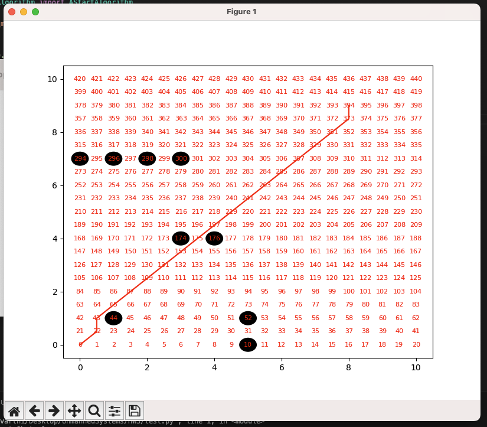
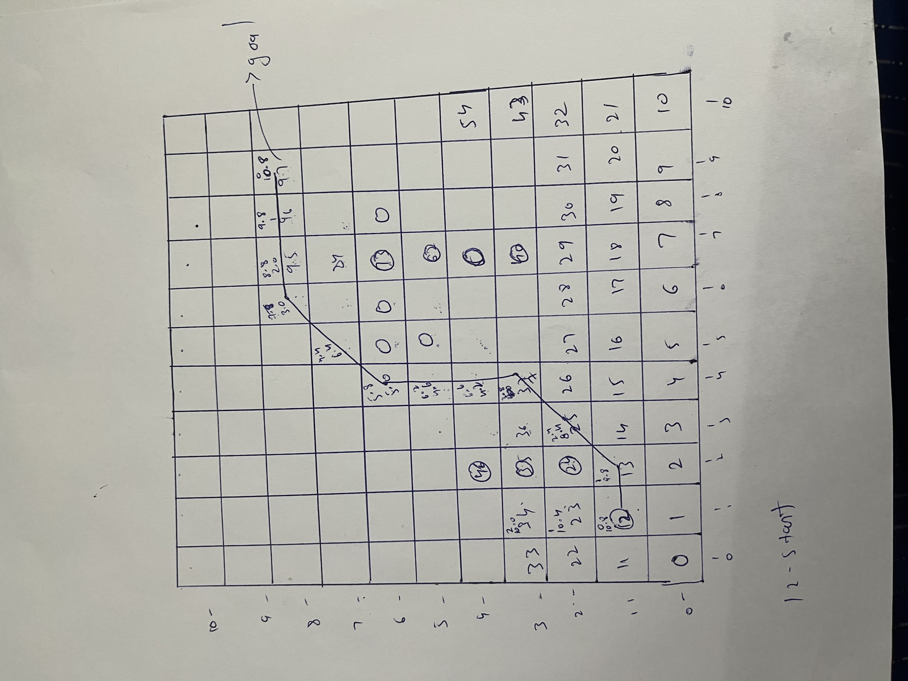
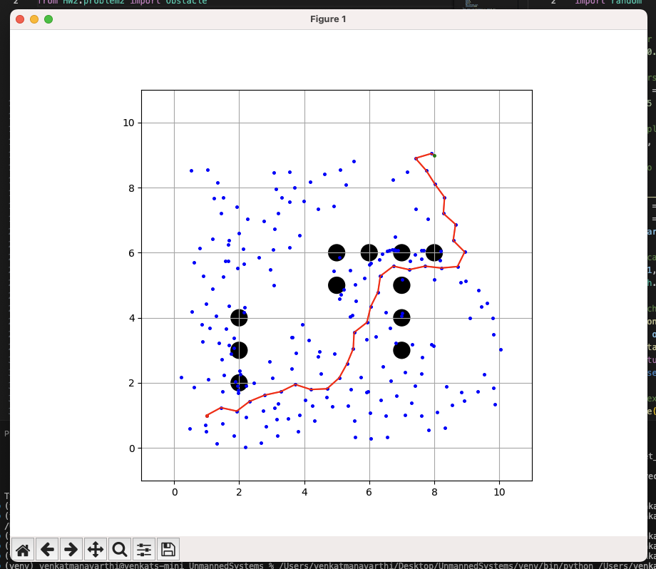
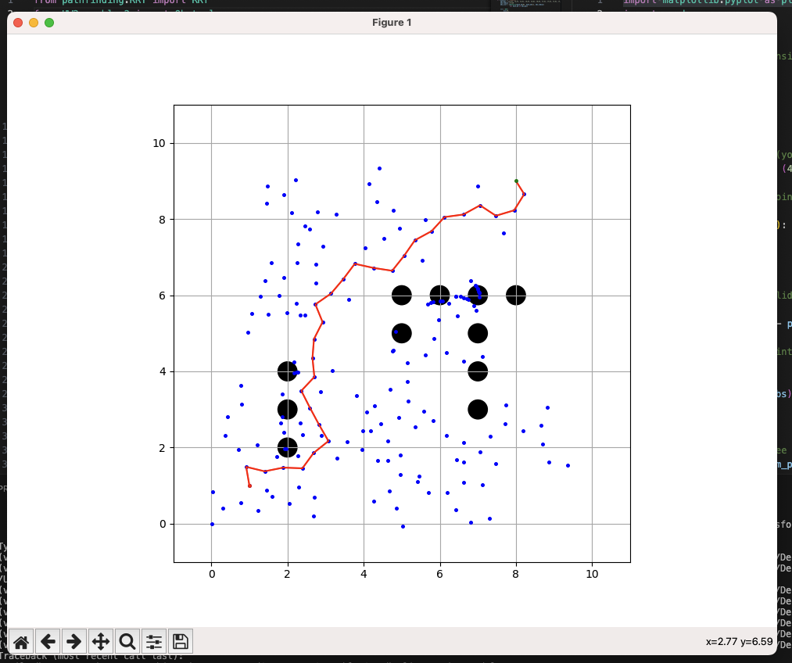

# Unmanned Systems HW3

## Problem 1
Modify your Dijkstra’s software to run the A* algorithm. This should require only small
modifications to the cost estimate for each cell. Rerun the same simulation environment as Problem
4 and show the x vs y graph. Put the image of the path in the document here

```
from HW2.problem2 import Obstacle
from AStar.AStartAlgorithm import AStartAlgorithm

if __name__ == "__main__":
    obs_pos = [(1, 1), (4, 4), (3, 4), (5, 0), (5, 1),
               (0, 7), (1, 7), (2, 7), (3, 7)]
    obs_radius = 0.25
    obs_list = [Obstacle(each_ob[0], each_ob[1], obs_radius)
                for each_ob in obs_pos]
    astart = AStartAlgorithm(0, 0, 10, 10, 0.5)
    route = astart.run(start=(0, 0), goal=(8, 9), r_radius=0, obs_list=obs_list)
    astart.plot_route(route=route)

```


## Problem 2
Given the map below, and a grid spacing of 1, use A* to compute the path (by hand) from start to
finish (start = red, goal = blue, obstacles = black)


## Problem 3
Modify your Dijkstra/A* code to use the RRT method to get from the start to the goal. Use the
same obstacle list and bounding box. Use a distance to jump (from nearest node in the tree) of 0.5.

Create a plot showing the tree (valid nodes) and the corresponding path to get from the start to the
goal for the same map as Problem 2.
```
from HW2.hw1 import Node 
from HW2.problem1 import calculate_distance
import random
import math

class RRT:

    def __init__(self, minx, maxx, miny, maxy, gs, obs_list, iterations=1000) -> None:
        """
        Args:
          iterations: max number of iterations
        Returns:
          None
        """
        self.minx = minx
        self.maxx = maxx
        self.miny = miny
        self.maxy = maxy
        self.gs = gs
        self.obs_list = obs_list
        self.iterations = iterations
        self.sample_hist = []
        self.goal = None
        self.start = None
        self.tree = None


    def path(self, goal_node: Node):
        """
        Args:
          goal_node(Node): goal node
        Returns:
          Full path from start to end
        """
        path_nodes = []
        current_node = goal_node
        while current_node != -1:
            path_nodes.append((current_node.x, current_node.y))
            current_node = current_node.parent_index
        return path_nodes
    
    def is_collision(self, point):
      for obs in self.obs_list:
          if obs.is_inside(cur_x=point.x, cur_y=point.y):
              return True
      return False
    
    def get_new_node(self, tree, random_point):
        nearest_node = None
        min_dist = float('inf')
        for node in tree:
            d = calculate_distance(x1=node.x, x2=random_point.x, y1=node.y, y2=random_point.y)
            if d < min_dist and not self.is_collision(node):
                nearest_node = node
                min_dist = d

        if nearest_node is not None:
            angle = math.atan2(random_point.y - nearest_node.y, random_point.x - nearest_node.x)
            new_x = nearest_node.x + self.gs * math.cos(angle)
            new_y = nearest_node.y + self.gs * math.sin(angle)
            new_node = Node(new_x, new_y)
            new_node.parent_index = nearest_node
            return new_node

        return None
    def run(self, start, goal):
        self.start = Node(start[0], start[1])
        self.goal = Node(goal[0], goal[1])
        rrt_tree = [self.start]
        for _ in range(self.iterations):
          random_point = Node(random.uniform(self.minx, self.maxx), random.uniform(self.miny, self.maxy))
          new_node = self.get_new_node(rrt_tree, random_point)
  
          if new_node:
              rrt_tree.append(new_node)
          
          if calculate_distance(x1=new_node.x, y1=new_node.y, x2=self.goal.x, y2=self.goal.y) < self.gs:
              self.goal.parent_index = new_node
              path = self.path(self.goal)
              return path, rrt_tree

```
```
from pathfinding.RRT import RRT
from HW2.problem2 import Obstacle
import matplotlib.pyplot as plt

if __name__ == "__main__":
    obs_pos = [(2,2), (2,3), (2,4), (5,5), (5,6), (6,6), (7,3), (7,4), (7,5), (7,6), (8,6)]
    obs_radius = 0.25
    obs_list = [Obstacle(each_ob[0], each_ob[1], obs_radius)
                for each_ob in obs_pos]
    
    rrt = RRT(
        minx=0,
        maxx=10,
        miny=0,
        maxy=10,
        gs=0.5,
        obs_list=obs_list,
        iterations=10000
    )
    path, tree = rrt.run(start=(1,1), goal=(8, 9))
    plt.figure(figsize=(8, 6))
    plt.plot([node.x for node in tree], [node.y for node in tree], 'bo', markersize=0.25 * 10)

    for obs in obs_list:
        circle = plt.Circle((obs.x, obs.y), obs_radius, color='black')
        plt.gca().add_patch(circle)

    plt.plot([point[0] for point in path], [point[1] for point in path], 'r')

    # Draw start and goal nodes
    plt.plot(1, 1, 'ro', markersize=0.25 * 10)
    plt.plot(8, 9, 'go', markersize=0.25 * 10)

    plt.xlim(-1, 11)
    plt.ylim(-1, 11)
    plt.gca().set_aspect('equal', adjustable='box')
    plt.grid(True)
    plt.show()

```



